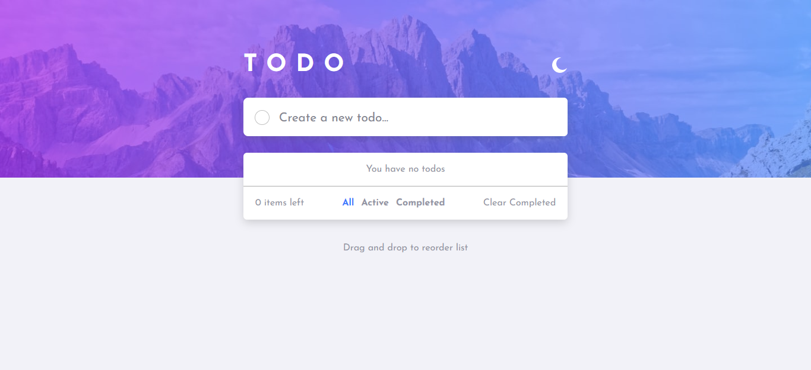
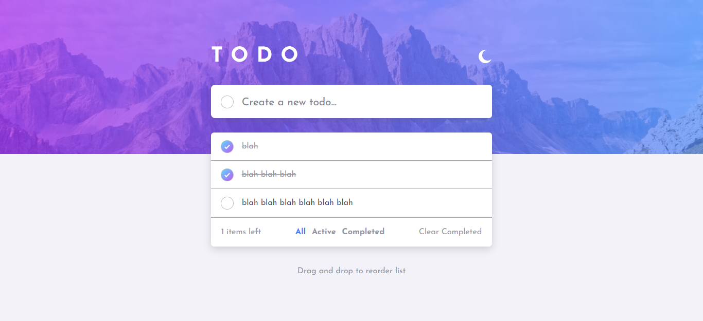
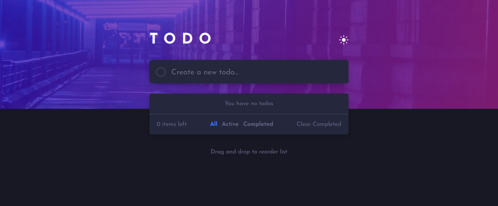
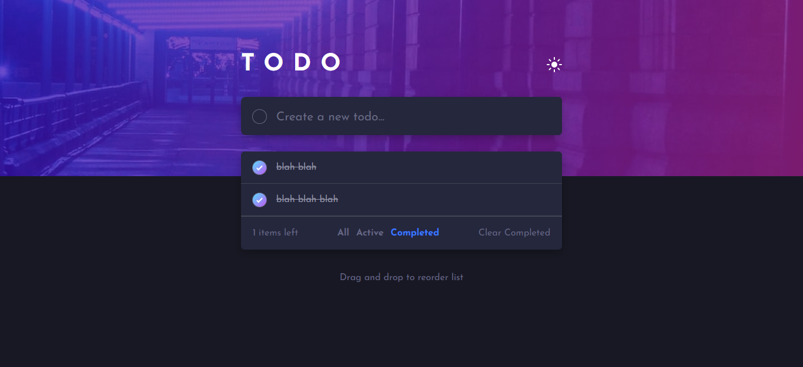

# Frontend Mentor - Todo app solution

This is a solution to the [Todo app challenge on Frontend Mentor](https://www.frontendmentor.io/challenges/todo-app-Su1_KokOW). Frontend Mentor challenges help you improve your coding skills by building realistic projects. 

## Table of contents

- [Overview](#overview)
  - [The challenge](#the-challenge)
  - [Screenshot](#screenshot)
  - [Links](#links)
- [My process](#my-process)
  - [Built with](#built-with)
  - [What I learned](#what-i-learned)
  - [Useful resources](#useful-resources)
- [Author](#author)

## Overview

### The challenge

Users should be able to:

- View the optimal layout for the app depending on their device's screen size
- See hover states for all interactive elements on the page
- Add new todos to the list
- Mark todos as complete
- Delete todos from the list
- Filter by all/active/complete todos
- Clear all completed todos
- Toggle light and dark mode
- **Bonus**: Drag and drop to reorder items on the list

### Screenshot









### Links

- Solution URL: (https://github.com/FaDiiiLeo/todo-app)
- Live Site URL: (https://fadiiileo.github.io/todo-app/)

## My process

### Built with

- Semantic HTML5 markup
- Flexbox
- CSS Preprocessor (Sass)
- CSS Media Queries
- Mobile-first workflow
- ES6 Javascript

### What I learned

- During this project I learned different DOM manipulation techniques and how they work like event capturing, event bubbling and event delegation which are really useful if you want to manipulate elements which are being created dynamically.

```js
parentDiv.addEventListener('click', function (e) {
    if (e.target.matches('div')) {
        // do something
    }
});
```

- I learned the drag and drop API for dragging and dropping/swapping different elements. I used different event listeners like dragstart, dragenter, dragover, dragleave and drop.

### Useful resources

- (https://www.youtube.com/watch?v=XF1_MlZ5l6M&t=587s&ab_channel=WebDevSimplified) - This is a really good video on event listeners and how to handle them. This video explains things like event listener basics, event bubbling/capturing, event delegation and some other small things

- (https://ramya-bala221190.medium.com/dragging-dropping-and-swapping-elements-with-javascript-11d9cdac2178) - This is an amazing article which helped me alot with learning drag and drop API using different drag and drop event listeners.

## Author

- Frontend Mentor - [@FaDiiiLeo](https://www.frontendmentor.io/profile/FaDiiiLeo)
- LinkedIn - [Fahad Akram](https://www.linkedin.com/in/fahad-akram-88bb9222b/)
- Stack Overflow - [Fahad](https://stackoverflow.com/users/12165302/fahad)
